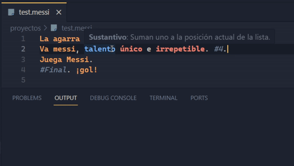

# MessiScript Syntax



## Características
- Resaltado de sintaxis.
- Autocompletado de comandos y descripciones.
- Soporte de comentarios `#Comentario.` o `//Comentario.`
- Snippets de código con ejemplos `ms:snippet`.
- Descripciones de Hover para parámetros.

### Como ejecutar MessiScript desde Visual Studio Code
En la configuración de la extensión [Code Runner](https://marketplace.visualstudio.com/items?itemName=formulahendry.code-runner) modificamos el json **Executor Map** y añadimos la línea:
```json
"messi": "pyhon set PYTHONIOENCODING=utf8 && C:\\...\\msinterpreter.py"
```
> Dependiendo de como esté instalado python en tu sistema puede que sea no necesario escribir python al principio o que haya que sustituirlo por 'py', 'python3' u otros.


### Notas
- Tema usado: [Ayu](https://marketplace.visualstudio.com/items?itemName=teabyii.ayu)
- Fuente: [Cascadia Code](https://github.com/microsoft/cascadia-code)
