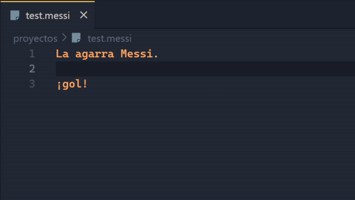
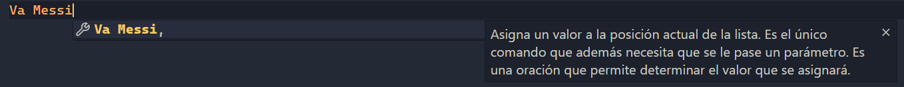
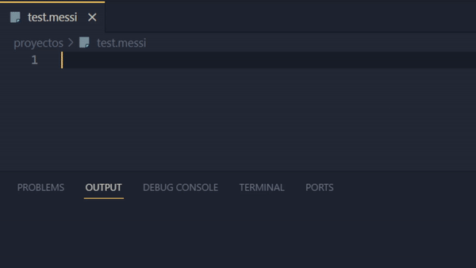

# MessiScript Syntax


Soporte para el lenguaje **[MessiScript](https://github.com/Erawaa/MessiScriptInterpreter)** en Visual Studio Code.

## Características
- Resaltado de sintaxis.
- Autocompletado de comandos y descripciones.
- Soporte de comentarios `#Comentario.` o `//Comentario.`
- Snippets de código con ejemplos `ms:snippet`.
- Descripciones de hover para parámetros.

## Instalación
La extensión sigue en desarrollo, se puede probar copiando el repositorio a tu carpeta de extensiones de Visual Studio Code localizada en: `C:\Users\USUARIO\.vscode\extensions`.

## Uso
- #### Autocompletado



La extensión da recomendaciones de autocompletado, así como proporcionar una descripción de cada uno de los comandos disponibles.

- #### Snippets


Snippets de código con ejemplos, todas las opciones de sustantivos y adjetivos.

## Como ejecutar MessiScript desde Visual Studio Code
En la configuración de la extensión **[Code Runner](https://marketplace.visualstudio.com/items?itemName=formulahendry.code-runner)** modificamos el JSON **Executor Map** y añadimos la línea:
```json
"messi": "python set PYTHONIOENCODING=utf8 && C:\\...\\msinterpreter.py"
```
> Dependiendo de como esté instalado Python en su sistema, puede que sea no necesario escribir Python al principio o que haya que sustituirlo por 'py', 'python3' u otros.

### Notas
- La extensión no dispone de una detección de errores en el código solo ayuda con el proceso de desarrollo.
- Tema usado: **[Ayu](https://marketplace.visualstudio.com/items?itemName=teabyii.ayu)**
- Fuente: **[Cascadia Code](https://github.com/microsoft/cascadia-code)**
